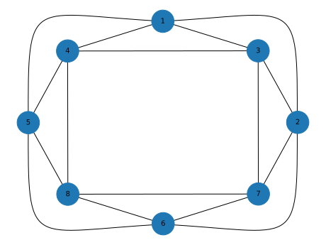

# Assignment 13 - Planarity

Test the undirected graph given by its links in the [attached file](links.csv) for planarity.  If the graph is planar, submit a plane drawing of it.  If the graph is not planar, present a subgraph of it that is subdivision of either `K_3,3` or `K_5`.

## Turn in

Planar:

